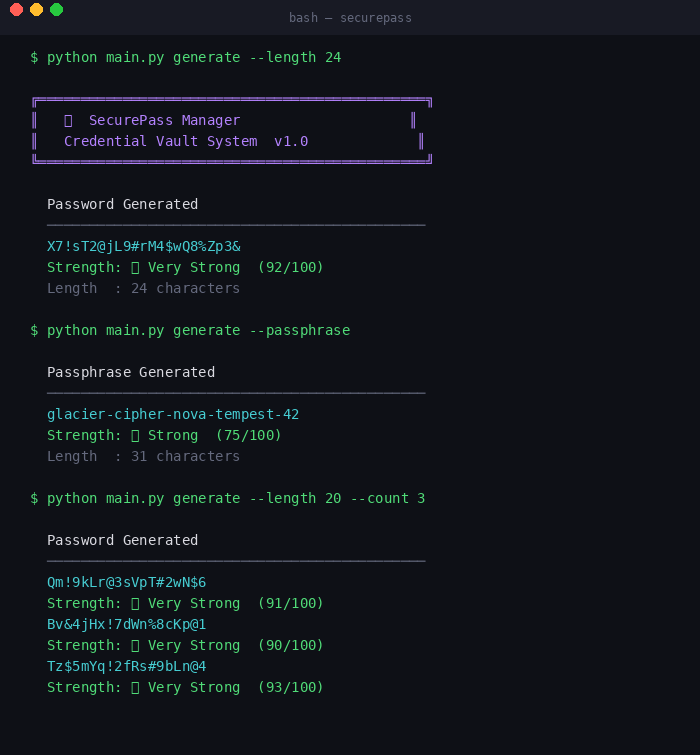
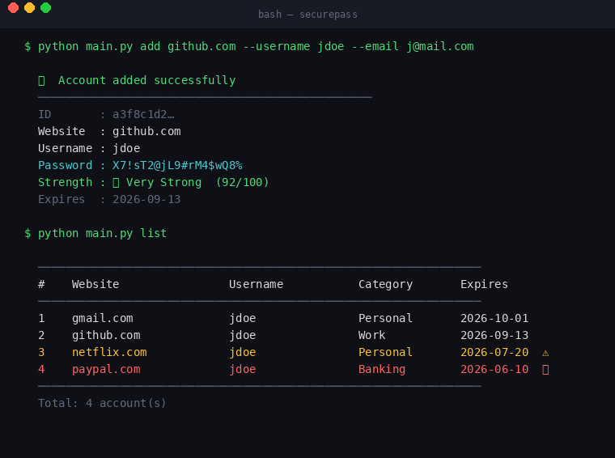
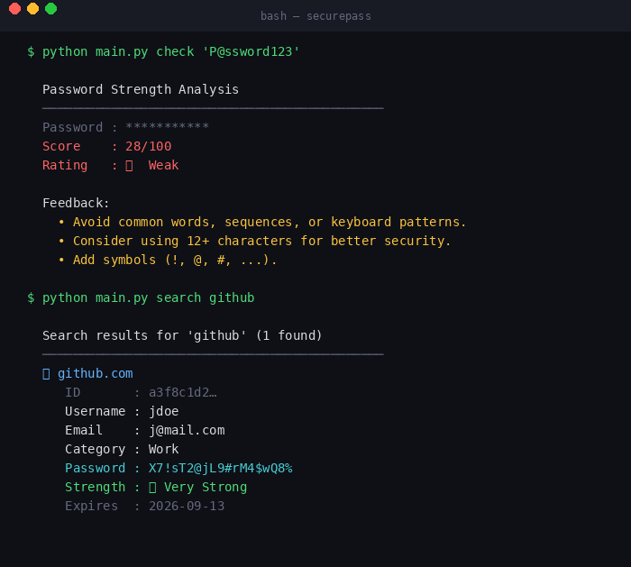
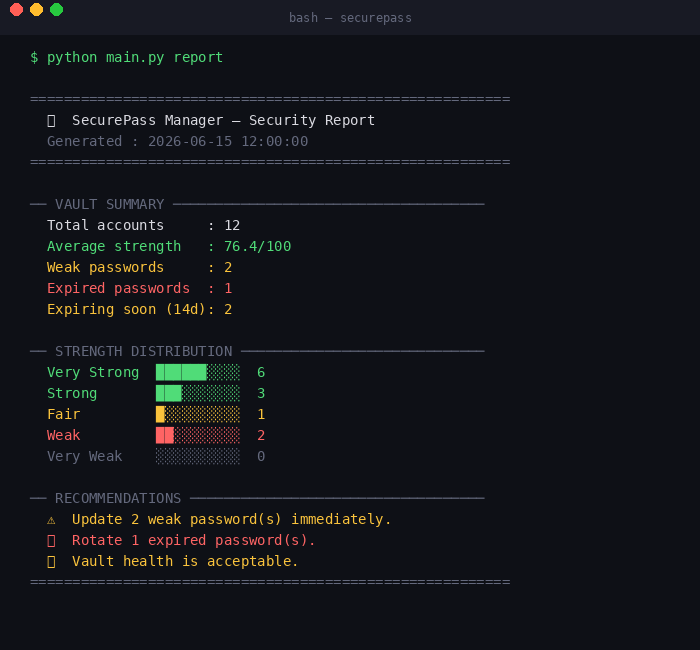
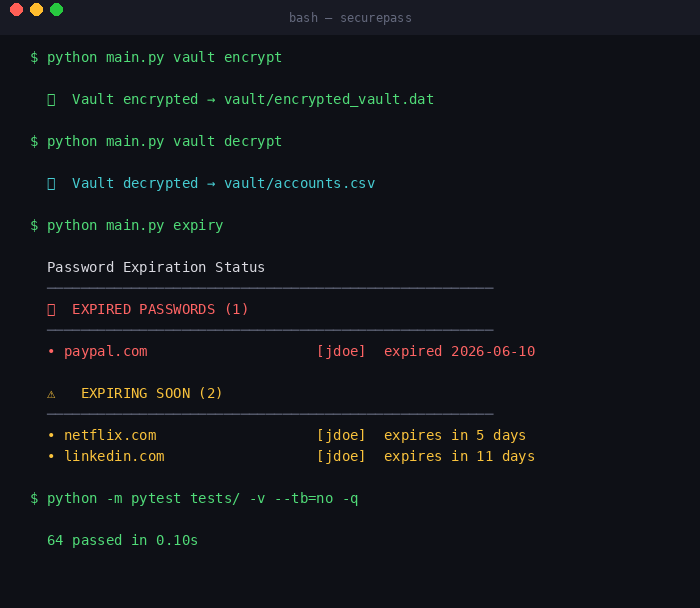

# SecurePass Manager

> A production-quality Python credential vault — generates cryptographically secure passwords, manages accounts, encrypts your vault with Fernet, tracks expiration, and produces security audit reports.


---

## Screenshots

### Password Generation (single, passphrase, batch)



### Add Account + List Vault



### Strength Checker + Search



### Security Audit Report



### Vault Encryption + Expiry Warnings + Tests



---

## Features

| Feature | Details |
|---|---|
| Secure generation | `secrets` module (CSPRNG) — never `random` |
| Strength analysis | 0–100 score, pattern detection, actionable tips |
| Account CRUD | Add, list, search, update, delete |
| Password history | Blocks reuse of last N passwords per account |
| Expiration tracking | Configurable expiry + 14-day advance warnings |
| Multi-format export | CSV + JSON dual persistence |
| Fernet encryption | AES-128-CBC + HMAC-SHA256 vault encryption |
| Security reports | Strength distribution, weak/expired summary |
| Categories | Personal, Work, Banking, Social Media, Gaming… |
| Passphrase mode | Word-based memorable passwords |
| Full audit log | Rotating file logging to `logs/app.log` |
| 63 tests | Unit + integration coverage across all modules |

---

## Quick Start

### 1. Clone & install

```bash
git clone https://github.com/luigi043/securepass-manager.git
cd securepass-manager
pip install -r requirements.txt
```

### 2. Generate a password

```bash
python main.py generate --length 24
python main.py generate --passphrase
python main.py generate --length 20 --count 5
python main.py generate --no-symbols --length 16
```

### 3. Check password strength

```bash
python main.py check "MyP@ssword123"
```

### 4. Add an account

```bash
python main.py add github.com --username jdoe --email j@example.com
python main.py add gmail.com --username jdoe --password "MyOwn!Pass1" --category Work --expiry 60
```

### 5. List & search

```bash
python main.py list
python main.py search github
```

### 6. Delete an account

```bash
python main.py delete a3f8c1d2     # use first 8 chars of the ID shown in list
```

### 7. Password expiration warnings

```bash
python main.py expiry
```

### 8. Security report

```bash
python main.py report
```

### 9. Encrypt & decrypt the vault

```bash
python main.py vault encrypt      # encrypts vault/accounts.csv → vault/encrypted_vault.dat
python main.py vault decrypt      # restores vault/accounts.csv from the encrypted vault
python main.py vault init         # generate a fresh encryption key (invalidates existing vault)
```

---

## Project Structure

```
securepass-manager/
├── main.py                        # CLI entry point (argparse)
├── requirements.txt
│
├── src/
│   ├── password_generator.py      # PasswordGenerator — secrets-based generation
│   ├── password_strength.py       # PasswordStrengthChecker — 0-100 scoring
│   ├── account_manager.py         # AccountManager — CRUD + password history
│   ├── encryption_service.py      # EncryptionService — Fernet encrypt/decrypt
│   ├── csv_manager.py             # CSVManager — CSV read/write
│   ├── json_manager.py            # JSONManager — JSON read/write
│   ├── expiration_manager.py      # ExpirationManager — expiry warnings
│   ├── report_generator.py        # ReportGenerator — security audit
│   └── vault_service.py           # VaultService — orchestrator
│
├── config/
│   └── config.json                # Application configuration
│
├── vault/
│   ├── accounts.csv               # Plaintext vault (auto-generated)
│   ├── accounts.json              # JSON backup (auto-generated)
│   ├── encrypted_vault.dat        # Fernet-encrypted vault
│   └── .vault.key                 # Master key — keep this secret!
│
├── reports/
│   └── security_report.txt        # Auto-generated audit report
│
├── logs/
│   └── app.log                    # Rotating audit log
│
├── tests/
│   ├── conftest.py
│   ├── test_generator.py          # 14 tests
│   ├── test_strength.py           # 13 tests
│   ├── test_account_manager.py    # 20 tests
│   ├── test_encryption_service.py # 8 tests
│   └── test_csv_json_managers.py  # 8 tests
│
└── docs/
    └── screenshots/
```

---

## Architecture

```
CLI (main.py / argparse)
        │
        ▼
  VaultService (orchestrator)
        │
   ┌────┴──────────────────────────────────┐
   │           │           │               │
PasswordGen  AccountMgr  Encryption    Expiration
Strength     CSV/JSON    (Fernet)      Reports
```

### Design Principles

- **Single Responsibility** — each class owns exactly one concern
- **Open/Closed** — add new categories/export formats without touching existing code
- **Dependency Injection** — `VaultService` receives components, easy to swap for testing
- **Fail-safe defaults** — dry-run, preview, no destructive defaults

---

## Configuration

Edit `config/config.json` to customise defaults:

```json
{
  "password": {
    "default_length": 20,
    "min_length": 8,
    "max_length": 128
  },
  "expiration": {
    "default_days": 90,
    "warn_days_before": 14
  },
  "history": {
    "max_entries": 5
  }
}
```

---

## Security Notes

| Practice | Implementation |
|---|---|
| Cryptographic RNG | `secrets.choice()` — OS CSPRNG, not `random` |
| Encryption | Fernet (AES-128-CBC + HMAC-SHA256) |
| Password history | SHA-256 hashes — raw passwords never stored in history |
| Key storage | `.vault.key` — `chmod 600` on Unix |
| Input validation | All inputs validated before storage |
| No hardcoded secrets | All config via `config.json` |

> **The `.vault.key` file is your master key.** Back it up securely. If lost, the encrypted vault cannot be recovered.

---

## Running Tests

```bash
# Run all 63 tests
python -m pytest tests/ -v

# With coverage
python -m pytest tests/ --cov=src --cov-report=term-missing
```

**Test coverage by module:**

| Module | Tests |
|---|---|
| `password_generator.py` | 14 |
| `password_strength.py` | 13 |
| `account_manager.py` | 20 |
| `encryption_service.py` | 8 |
| `csv_manager.py` + `json_manager.py` | 8 |
| **Total** | **63** |

---

## CLI Reference

```
Commands:
  generate    Generate a secure password or passphrase
  check       Analyse password strength
  add         Add a new account to the vault
  list        List all accounts
  search      Search by website, username, or email
  delete      Delete an account by ID
  expiry      Show expiring and expired passwords
  report      Generate a full security audit report
  vault       Encrypt, decrypt, or initialise the vault

generate flags:
  --length N          Password length (default: 20)
  --count N           Number of passwords to generate
  --passphrase        Generate a word-based passphrase
  --no-upper          Exclude uppercase letters
  --no-lower          Exclude lowercase letters
  --no-digits         Exclude digits
  --no-symbols        Exclude symbols

add flags:
  website             Website or service name (required)
  --username / -u     Login username (required)
  --email / -e        Email address
  --password / -p     Password (auto-generated if omitted)
  --category / -c     Category (default: Personal)
  --notes / -n        Optional notes
  --expiry            Days until expiry (default: 90, 0 = never)

vault flags:
  encrypt             Encrypt CSV vault → encrypted_vault.dat
  decrypt             Decrypt vault → accounts.csv
  init                Generate a fresh encryption key
```

---

## Roadmap

- [x] v1 — Password generation + CSV export
- [x] v2 — Account CRUD + strength checker + search
- [x] v3 — Fernet encryption + expiry tracking + security reports + 63 tests
- [ ] v4 — Streamlit dashboard, clipboard copy, HaveIBeenPwned API, QR sharing

---

## Portfolio Description

> Developed a secure credential management application in Python capable of generating cryptographically secure passwords using the `secrets` module, evaluating password strength with pattern detection and scoring, managing account records with full CRUD operations, exporting credentials to CSV and JSON, encrypting the vault using Fernet (AES-128-CBC + HMAC-SHA256), tracking password expiration with advance warnings, preventing password reuse via SHA-256 history, and generating actionable security audit reports. Built with clean architecture, SOLID principles, type hints, docstrings, and 63 unit and integration tests.

---

## License

MIT — free to use, modify, and distribute.
